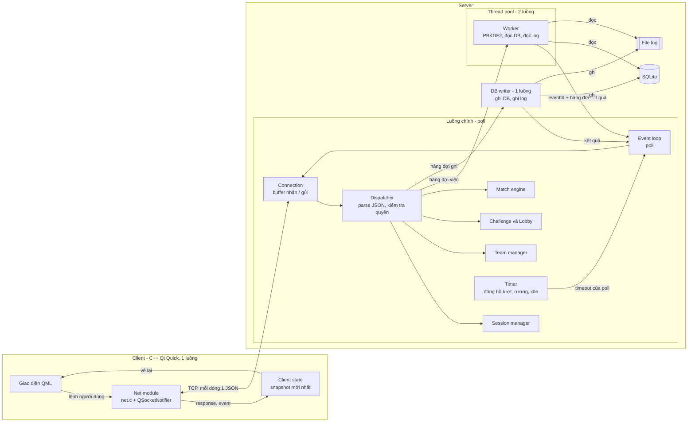

# Kiến trúc tổng thể

Mô tả luồng: [DESIGN.md](../DESIGN.md)

```mermaid
flowchart LR
    subgraph Client["Client - C++ Qt Quick, 1 luồng"]
        UI["Giao diện QML"]
        CNET["Net module<br/>net.c + QSocketNotifier"]
        CSTATE["Client state<br/>snapshot mới nhất"]
        UI -->|"lệnh người dùng"| CNET
        CNET -->|"response, event"| CSTATE
        CSTATE -->|"vẽ lại"| UI
    end

    subgraph Server["Server"]
        subgraph Main["Luồng chính - poll"]
            LOOP["Event loop<br/>poll"]
            CONN["Connection<br/>buffer nhận / gửi"]
            DISP["Dispatcher<br/>parse JSON, kiểm tra quyền"]
            SESS["Session manager"]
            TEAM["Team manager"]
            LOBBY["Challenge và Lobby"]
            MATCH["Match engine"]
            TIMER["Timer<br/>đồng hồ lượt, rương, idle"]
        end
        subgraph Pool["Thread pool - 2 luồng"]
            W["Worker<br/>PBKDF2, đọc DB, đọc log"]
        end
        WR["DB writer - 1 luồng<br/>ghi DB, ghi log"]
        DB[("SQLite")]
        LOG[["File log"]]
    end

    CNET <-->|"TCP, mỗi dòng 1 JSON"| CONN
    LOOP --> CONN --> DISP
    DISP --> SESS & TEAM & LOBBY & MATCH
    TIMER -->|"timeout của poll"| LOOP
    DISP -->|"hàng đợi việc"| W
    W -->|"eventfd + hàng đợi kết quả"| LOOP
    W -->|"đọc"| DB
    W -->|"đọc"| LOG
    DISP -->|"hàng đợi ghi"| WR
    WR -->|"kết quả"| LOOP
    WR -->|"ghi"| DB
    WR -->|"ghi"| LOG
```
