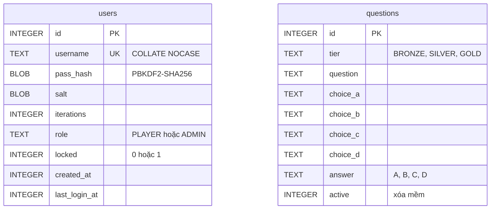

# Sơ đồ quan hệ database

Mô tả: [DATABASE.md](../DATABASE.md)

DB chỉ có 2 bảng độc lập. Đội (party) và lịch sử trận không lưu trong DB.

```mermaid
erDiagram
    users {
        INTEGER id PK
        TEXT username UK "COLLATE NOCASE"
        BLOB pass_hash "PBKDF2-SHA256"
        BLOB salt
        INTEGER iterations
        TEXT role "PLAYER hoặc ADMIN"
        INTEGER locked "0 hoặc 1"
        INTEGER created_at
        INTEGER last_login_at
    }
    questions {
        INTEGER id PK
        TEXT tier "BRONZE, SILVER, GOLD"
        TEXT question
        TEXT choice_a
        TEXT choice_b
        TEXT choice_c
        TEXT choice_d
        TEXT answer "A, B, C, D"
        INTEGER active "xóa mềm"
    }
```
