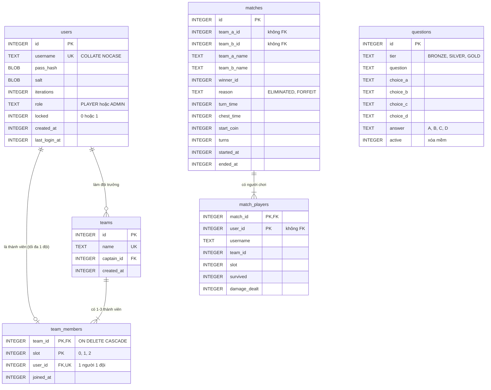

# Sơ đồ quan hệ database

Mô tả: [DATABASE.md](../DATABASE.md)

```mermaid
erDiagram
    users ||--o| team_members : "là thành viên (tối đa 1 đội)"
    teams ||--|{ team_members : "có 1-3 thành viên"
    users ||--o{ teams : "làm đội trưởng"
    matches ||--|{ match_players : "có người chơi"

    users {
        INTEGER id PK
        TEXT username UK "COLLATE NOCASE"
        BLOB pass_hash
        BLOB salt
        INTEGER iterations
        TEXT role "PLAYER hoặc ADMIN"
        INTEGER locked "0 hoặc 1"
        INTEGER created_at
        INTEGER last_login_at
    }
    teams {
        INTEGER id PK
        TEXT name UK
        INTEGER captain_id FK
        INTEGER created_at
    }
    team_members {
        INTEGER team_id PK,FK "ON DELETE CASCADE"
        INTEGER slot PK "0, 1, 2"
        INTEGER user_id FK,UK "1 người 1 đội"
        INTEGER joined_at
    }
    questions {
        INTEGER id PK
        TEXT tier "BRONZE, SILVER, GOLD"
        TEXT question
        TEXT choice_a
        TEXT choice_b
        TEXT choice_c
        TEXT choice_d
        TEXT answer "A, B, C, D"
        INTEGER active "xóa mềm"
    }
    matches {
        INTEGER id PK
        INTEGER team_a_id "không FK"
        INTEGER team_b_id "không FK"
        TEXT team_a_name
        TEXT team_b_name
        INTEGER winner_id
        TEXT reason "ELIMINATED, FORFEIT"
        INTEGER turn_time
        INTEGER chest_time
        INTEGER start_coin
        INTEGER turns
        INTEGER started_at
        INTEGER ended_at
    }
    match_players {
        INTEGER match_id PK,FK
        INTEGER user_id PK "không FK"
        TEXT username
        INTEGER team_id
        INTEGER slot
        INTEGER survived
        INTEGER damage_dealt
    }
```
