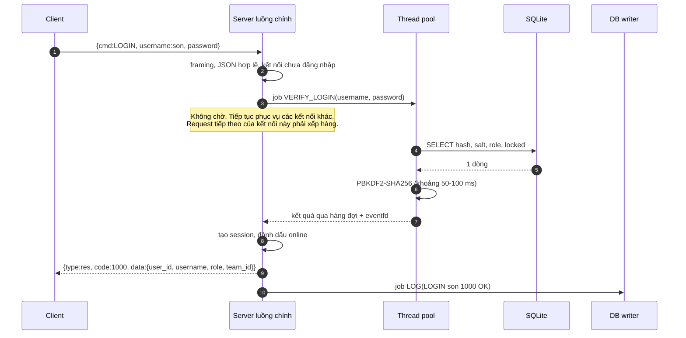

# Đăng nhập (có thread pool)

Mô tả luồng: [DESIGN.md](../../DESIGN.md)

```mermaid
sequenceDiagram
    autonumber
    participant C as Client
    participant S as Server luồng chính
    participant P as Thread pool
    participant D as SQLite
    participant W as DB writer

    C->>S: {cmd:LOGIN, username:son, password}
    S->>S: framing, JSON hợp lệ, kết nối chưa đăng nhập
    S->>P: job VERIFY_LOGIN(username, password)
    Note over S: Không chờ. Tiếp tục phục vụ các kết nối khác.<br/>Request tiếp theo của kết nối này phải xếp hàng.
    P->>D: SELECT hash, salt, role, locked
    D-->>P: 1 dòng
    P->>P: PBKDF2-SHA256 (khoảng 50-100 ms)
    P-->>S: kết quả qua hàng đợi + eventfd
    S->>S: tạo session, đánh dấu online
    S-->>C: {type:res, code:1000, data:{user_id, username, role, team_id}}
    S->>W: job LOG(LOGIN son 1000 OK)
```
