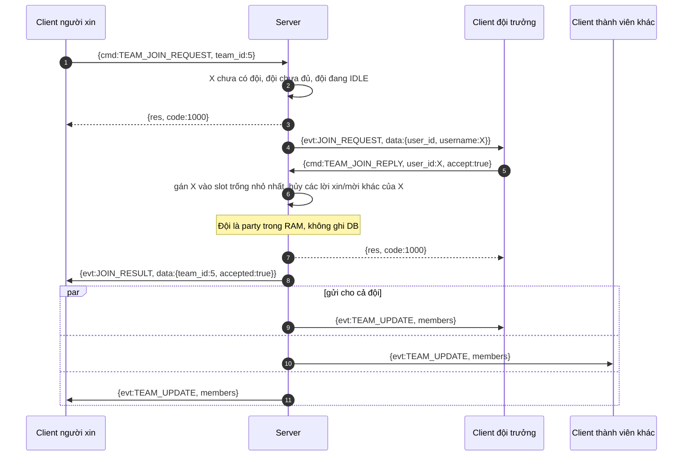

# Xin vào đội và được duyệt

Mô tả luồng: [DESIGN.md](../../DESIGN.md)

```mermaid
sequenceDiagram
    autonumber
    participant X as Client người xin
    participant S as Server
    participant K as Client đội trưởng
    participant M as Client thành viên khác

    X->>S: {cmd:TEAM_JOIN_REQUEST, team_id:5}
    S->>S: X chưa có đội, đội chưa đủ, đội đang IDLE
    S-->>X: {res, code:1000}
    S->>K: {evt:JOIN_REQUEST, data:{user_id, username:X}}

    K->>S: {cmd:TEAM_JOIN_REPLY, user_id:X, accept:true}
    S->>S: gán X vào slot trống nhỏ nhất, hủy các lời xin/mời khác của X
    Note over S: Đội là party trong RAM, không ghi DB
    S-->>K: {res, code:1000}
    S->>X: {evt:JOIN_RESULT, data:{team_id:5, accepted:true}}
    par gửi cho cả đội
        S->>K: {evt:TEAM_UPDATE, members}
    and
        S->>M: {evt:TEAM_UPDATE, members}
    and
        S->>X: {evt:TEAM_UPDATE, members}
    end
```
