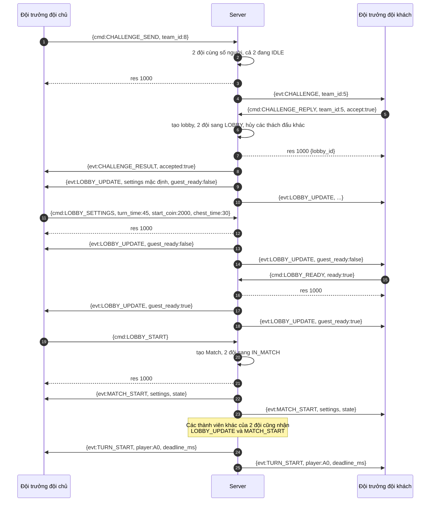

# Thách đấu, sảnh chờ, bắt đầu trận

Mô tả luồng: [DESIGN.md](../../DESIGN.md)

```mermaid
sequenceDiagram
    autonumber
    participant H as Đội trưởng đội chủ
    participant S as Server
    participant G as Đội trưởng đội khách

    H->>S: {cmd:CHALLENGE_SEND, team_id:8}
    S->>S: 2 đội cùng số người, cả 2 đang IDLE
    S-->>H: res 1000
    S->>G: {evt:CHALLENGE, team_id:5}

    G->>S: {cmd:CHALLENGE_REPLY, team_id:5, accept:true}
    S->>S: tạo lobby, 2 đội sang LOBBY, hủy các thách đấu khác
    S-->>G: res 1000 {lobby_id}
    S->>H: {evt:CHALLENGE_RESULT, accepted:true}
    S->>H: {evt:LOBBY_UPDATE, settings mặc định, guest_ready:false}
    S->>G: {evt:LOBBY_UPDATE, ...}

    H->>S: {cmd:LOBBY_SETTINGS, turn_time:45, start_coin:2000, chest_time:30}
    S-->>H: res 1000
    S->>H: {evt:LOBBY_UPDATE, guest_ready:false}
    S->>G: {evt:LOBBY_UPDATE, guest_ready:false}

    G->>S: {cmd:LOBBY_READY, ready:true}
    S-->>G: res 1000
    S->>H: {evt:LOBBY_UPDATE, guest_ready:true}
    S->>G: {evt:LOBBY_UPDATE, guest_ready:true}

    H->>S: {cmd:LOBBY_START}
    S->>S: tạo Match, 2 đội sang IN_MATCH
    S-->>H: res 1000
    S->>H: {evt:MATCH_START, settings, state}
    S->>G: {evt:MATCH_START, settings, state}
    Note over S: Các thành viên khác của 2 đội cũng nhận<br/>LOBBY_UPDATE và MATCH_START
    S->>H: {evt:TURN_START, player:A0, deadline_ms}
    S->>G: {evt:TURN_START, player:A0, deadline_ms}
```
