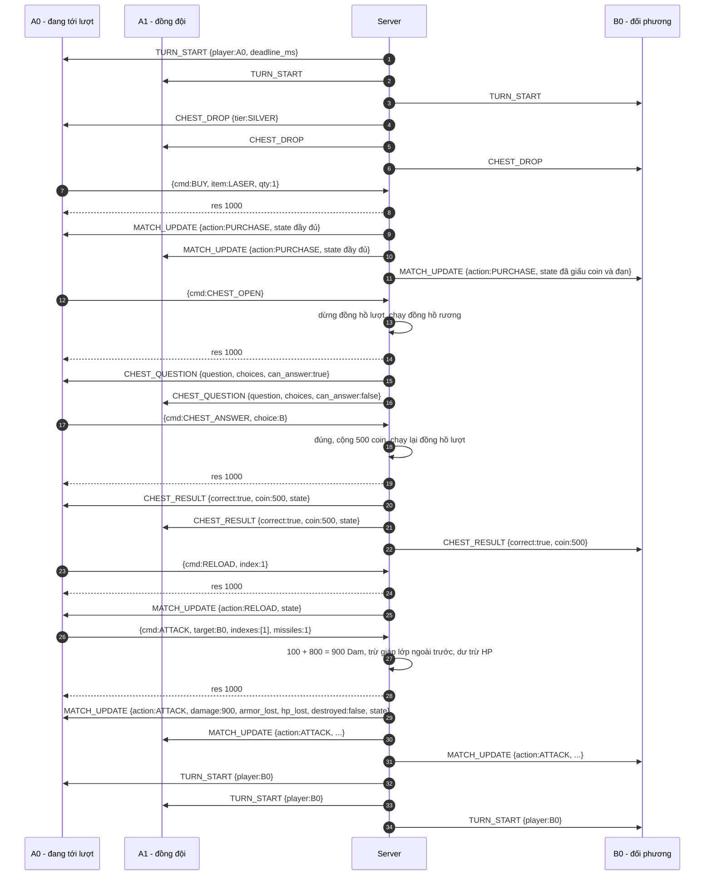

# Một lượt đầy đủ: mua, mở rương, tấn công

Mô tả luồng: [DESIGN.md](../../DESIGN.md)

```mermaid
sequenceDiagram
    autonumber
    participant A as A0 - đang tới lượt
    participant T as A1 - đồng đội
    participant S as Server
    participant B as B0 - đối phương

    S->>A: TURN_START {player:A0, deadline_ms}
    S->>T: TURN_START
    S->>B: TURN_START
    S->>A: CHEST_DROP {tier:SILVER}
    S->>T: CHEST_DROP
    S->>B: CHEST_DROP

    A->>S: {cmd:BUY, item:LASER, qty:1}
    S-->>A: res 1000
    S->>A: MATCH_UPDATE {action:PURCHASE, state đầy đủ}
    S->>T: MATCH_UPDATE {action:PURCHASE, state đầy đủ}
    S->>B: MATCH_UPDATE {action:PURCHASE, state đã giấu coin và đạn}

    A->>S: {cmd:CHEST_OPEN}
    S->>S: dừng đồng hồ lượt, chạy đồng hồ rương
    S-->>A: res 1000
    S->>A: CHEST_QUESTION {question, choices, can_answer:true}
    S->>T: CHEST_QUESTION {question, choices, can_answer:false}

    A->>S: {cmd:CHEST_ANSWER, choice:B}
    S->>S: đúng, cộng 500 coin, chạy lại đồng hồ lượt
    S-->>A: res 1000
    S->>A: CHEST_RESULT {correct:true, coin:500, state}
    S->>T: CHEST_RESULT {correct:true, coin:500, state}
    S->>B: CHEST_RESULT {correct:true, coin:500}

    A->>S: {cmd:RELOAD, index:1}
    S-->>A: res 1000
    S->>A: MATCH_UPDATE {action:RELOAD, state}

    A->>S: {cmd:ATTACK, target:B0, indexes:[1], missiles:1}
    S->>S: 100 + 800 = 900 Dam, trừ giáp lớp ngoài trước, dư trừ HP
    S-->>A: res 1000
    S->>A: MATCH_UPDATE {action:ATTACK, damage:900, armor_lost, hp_lost, destroyed:false, state}
    S->>T: MATCH_UPDATE {action:ATTACK, ...}
    S->>B: MATCH_UPDATE {action:ATTACK, ...}
    S->>A: TURN_START {player:B0}
    S->>T: TURN_START {player:B0}
    S->>B: TURN_START {player:B0}
```
