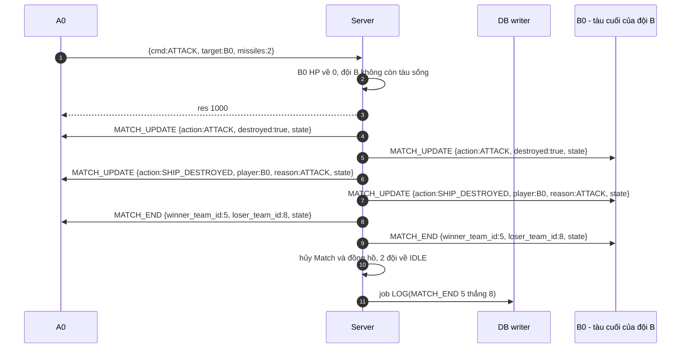

# Kết thúc trận

Mô tả luồng: [DESIGN.md](../../DESIGN.md)

```mermaid
sequenceDiagram
    autonumber
    participant A as A0
    participant S as Server
    participant W as DB writer
    participant B as B0 - tàu cuối của đội B

    A->>S: {cmd:ATTACK, target:B0, missiles:2}
    S->>S: B0 HP về 0, đội B không còn tàu sống
    S-->>A: res 1000
    S->>A: MATCH_UPDATE {action:ATTACK, destroyed:true, state}
    S->>B: MATCH_UPDATE {action:ATTACK, destroyed:true, state}
    S->>A: MATCH_UPDATE {action:SHIP_DESTROYED, player:B0, reason:ATTACK, state}
    S->>B: MATCH_UPDATE {action:SHIP_DESTROYED, player:B0, reason:ATTACK, state}
    S->>A: MATCH_END {winner_team_id:5, loser_team_id:8, state}
    S->>B: MATCH_END {winner_team_id:5, loser_team_id:8, state}
    S->>S: hủy Match và đồng hồ, 2 đội về IDLE
    S->>W: job LOG(MATCH_END 5 thắng 8)
```
