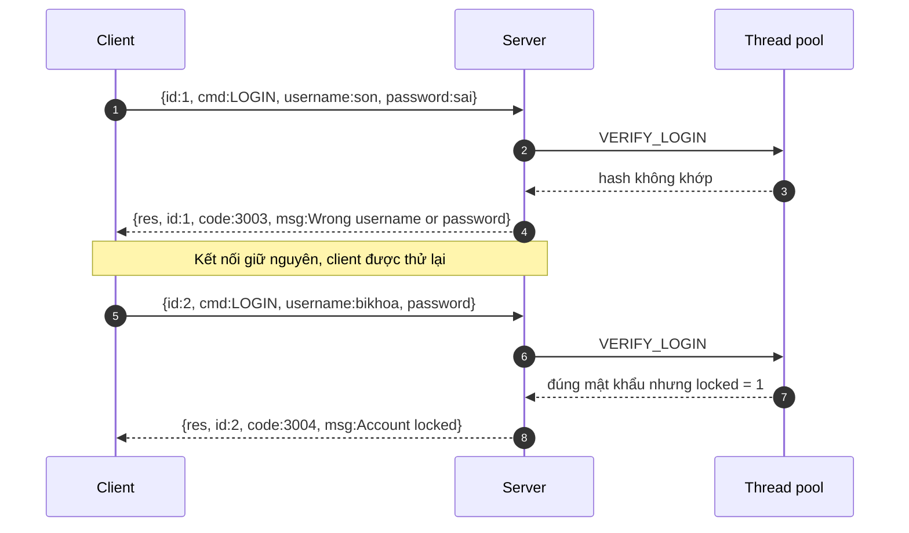

# Lỗi đăng nhập

Mô tả luồng: [DESIGN.md](../../DESIGN.md)

```mermaid
sequenceDiagram
    autonumber
    participant C as Client
    participant S as Server
    participant P as Thread pool

    C->>S: {id:1, cmd:LOGIN, username:son, password:sai}
    S->>P: VERIFY_LOGIN
    P-->>S: hash không khớp
    S-->>C: {res, id:1, code:3003, msg:Wrong username or password}
    Note over C,S: Kết nối giữ nguyên, client được thử lại

    C->>S: {id:2, cmd:LOGIN, username:bikhoa, password}
    S->>P: VERIFY_LOGIN
    P-->>S: đúng mật khẩu nhưng locked = 1
    S-->>C: {res, id:2, code:3004, msg:Account locked}
```
