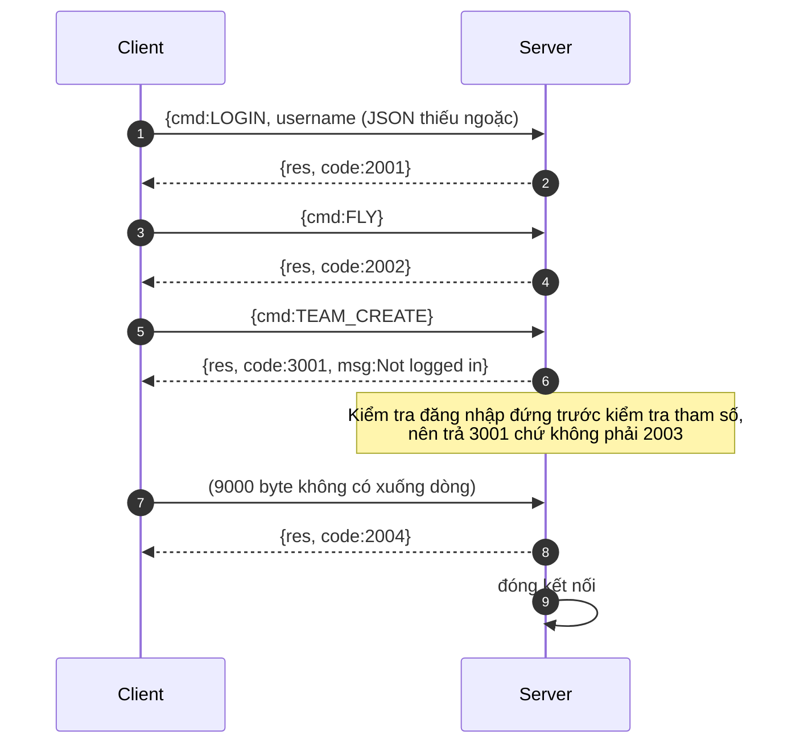

# Lỗi định dạng và lỗi chưa đăng nhập

Mô tả luồng: [DESIGN.md](../../DESIGN.md)

```mermaid
sequenceDiagram
    autonumber
    participant C as Client
    participant S as Server

    C->>S: {cmd:LOGIN, username (JSON thiếu ngoặc)
    S-->>C: {res, code:2001}
    C->>S: {cmd:FLY}
    S-->>C: {res, code:2002}
    C->>S: {cmd:TEAM_CREATE}
    S-->>C: {res, code:3001, msg:Not logged in}
    Note over S: Kiểm tra đăng nhập đứng trước kiểm tra tham số,<br/>nên trả 3001 chứ không phải 2003
    C->>S: (9000 byte không có xuống dòng)
    S-->>C: {res, code:2004}
    S->>S: đóng kết nối
```
