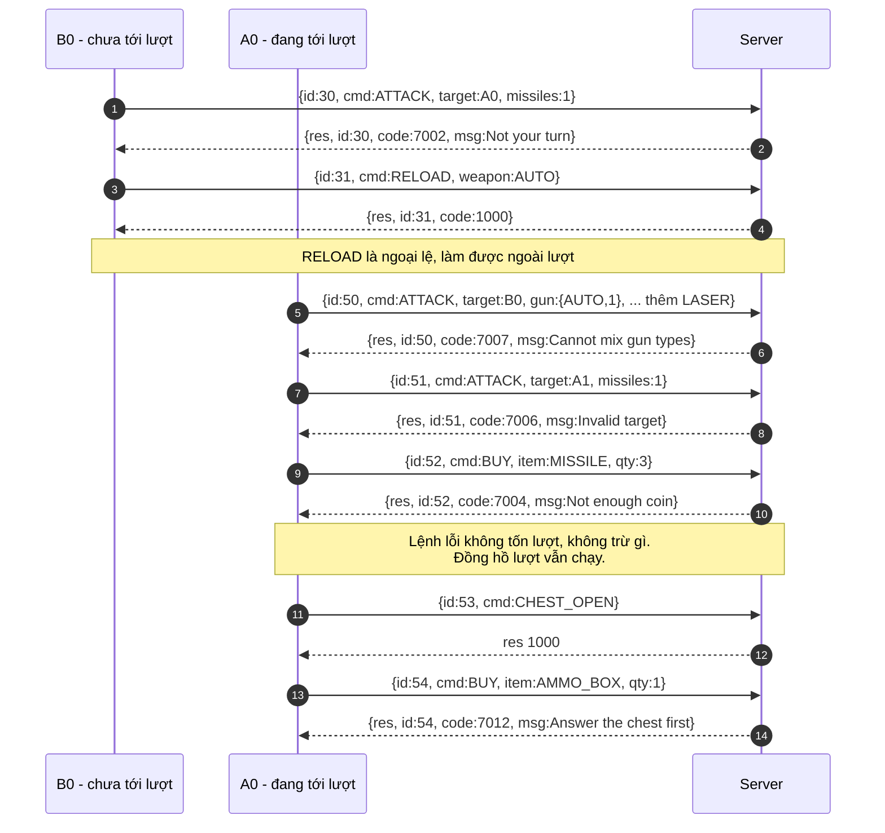

# Lỗi luật chơi trong trận

Mô tả luồng: [DESIGN.md](../../DESIGN.md)

```mermaid
sequenceDiagram
    autonumber
    participant B as B0 - chưa tới lượt
    participant A as A0 - đang tới lượt
    participant S as Server

    B->>S: {id:30, cmd:ATTACK, target:A0, missiles:1}
    S-->>B: {res, id:30, code:7002, msg:Not your turn}
    B->>S: {id:31, cmd:RELOAD, weapon:AUTO}
    S-->>B: {res, id:31, code:1000}
    Note over B,S: RELOAD là ngoại lệ, làm được ngoài lượt

    A->>S: {id:50, cmd:ATTACK, target:B0, gun:{AUTO,1}, ... thêm LASER}
    S-->>A: {res, id:50, code:7007, msg:Cannot mix gun types}
    A->>S: {id:51, cmd:ATTACK, target:A1, missiles:1}
    S-->>A: {res, id:51, code:7006, msg:Invalid target}
    A->>S: {id:52, cmd:BUY, item:MISSILE, qty:3}
    S-->>A: {res, id:52, code:7004, msg:Not enough coin}
    Note over A,S: Lệnh lỗi không tốn lượt, không trừ gì.<br/>Đồng hồ lượt vẫn chạy.

    A->>S: {id:53, cmd:CHEST_OPEN}
    S-->>A: res 1000
    A->>S: {id:54, cmd:BUY, item:AMMO_BOX, qty:1}
    S-->>A: {res, id:54, code:7012, msg:Answer the chest first}
```
