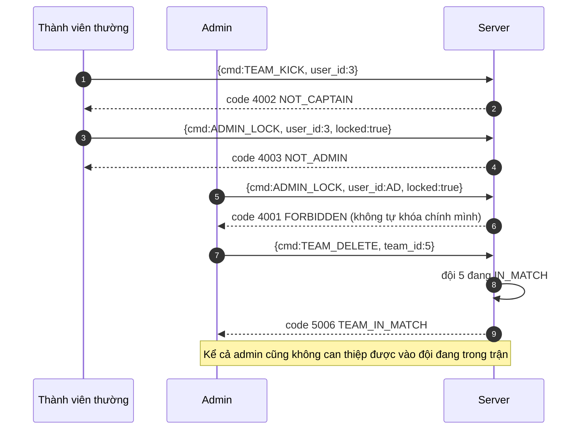

# Lỗi phân quyền

Mô tả luồng: [DESIGN.md](../../DESIGN.md)

```mermaid
sequenceDiagram
    autonumber
    participant M as Thành viên thường
    participant AD as Admin
    participant S as Server

    M->>S: {cmd:TEAM_KICK, user_id:3}
    S-->>M: code 4002 NOT_CAPTAIN
    M->>S: {cmd:ADMIN_LOCK, user_id:3, locked:true}
    S-->>M: code 4003 NOT_ADMIN

    AD->>S: {cmd:ADMIN_LOCK, user_id:AD, locked:true}
    S-->>AD: code 4001 FORBIDDEN (không tự khóa chính mình)

    AD->>S: {cmd:TEAM_DELETE, team_id:5}
    S->>S: đội 5 đang IN_MATCH
    S-->>AD: code 5006 TEAM_IN_MATCH
    Note over AD,S: Kể cả admin cũng không can thiệp được vào đội đang trong trận
```
