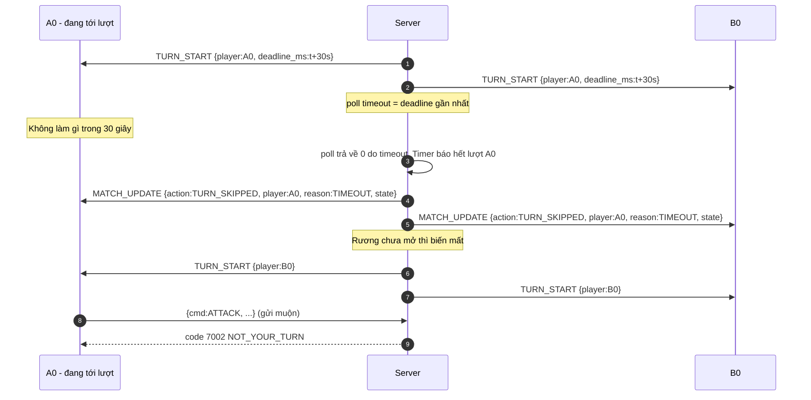

# Hết giờ lượt

Mô tả luồng: [DESIGN.md](../../DESIGN.md)

```mermaid
sequenceDiagram
    autonumber
    participant A as A0 - đang tới lượt
    participant S as Server
    participant B as B0

    S->>A: TURN_START {player:A0, deadline_ms:t+30s}
    S->>B: TURN_START {player:A0, deadline_ms:t+30s}
    Note over S: poll timeout = deadline gần nhất
    Note over A: Không làm gì trong 30 giây
    S->>S: poll trả về 0 do timeout, Timer báo hết lượt A0
    S->>A: MATCH_UPDATE {action:TURN_SKIPPED, player:A0, reason:TIMEOUT, state}
    S->>B: MATCH_UPDATE {action:TURN_SKIPPED, player:A0, reason:TIMEOUT, state}
    Note over S: Rương chưa mở thì biến mất
    S->>A: TURN_START {player:B0}
    S->>B: TURN_START {player:B0}
    A->>S: {cmd:ATTACK, ...} (gửi muộn)
    S-->>A: code 7002 NOT_YOUR_TURN
```
