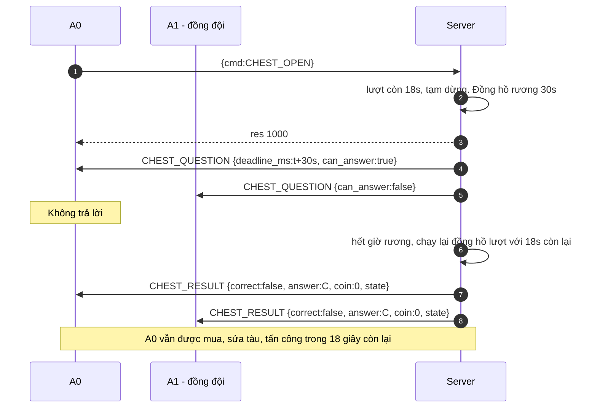

# Hết giờ rương

Mô tả luồng: [DESIGN.md](../../DESIGN.md)

```mermaid
sequenceDiagram
    autonumber
    participant A as A0
    participant T as A1 - đồng đội
    participant S as Server

    A->>S: {cmd:CHEST_OPEN}
    S->>S: lượt còn 18s, tạm dừng. Đồng hồ rương 30s
    S-->>A: res 1000
    S->>A: CHEST_QUESTION {deadline_ms:t+30s, can_answer:true}
    S->>T: CHEST_QUESTION {can_answer:false}
    Note over A: Không trả lời
    S->>S: hết giờ rương, chạy lại đồng hồ lượt với 18s còn lại
    S->>A: CHEST_RESULT {correct:false, answer:C, coin:0, state}
    S->>T: CHEST_RESULT {correct:false, answer:C, coin:0, state}
    Note over A,S: A0 vẫn được mua, sửa tàu, tấn công trong 18 giây còn lại
```
