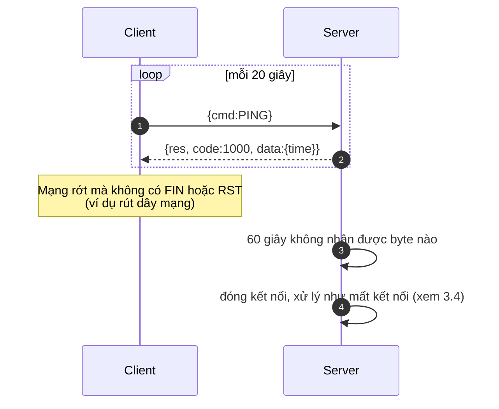

# Kết nối im lặng quá lâu

Mô tả luồng: [DESIGN.md](../../DESIGN.md)

```mermaid
sequenceDiagram
    autonumber
    participant C as Client
    participant S as Server

    loop mỗi 20 giây
        C->>S: {cmd:PING}
        S-->>C: {res, code:1000, data:{time}}
    end
    Note over C: Mạng rớt mà không có FIN hoặc RST<br/>(ví dụ rút dây mạng)
    S->>S: 60 giây không nhận được byte nào
    S->>S: đóng kết nối, xử lý như mất kết nối (xem 3.4)
```
