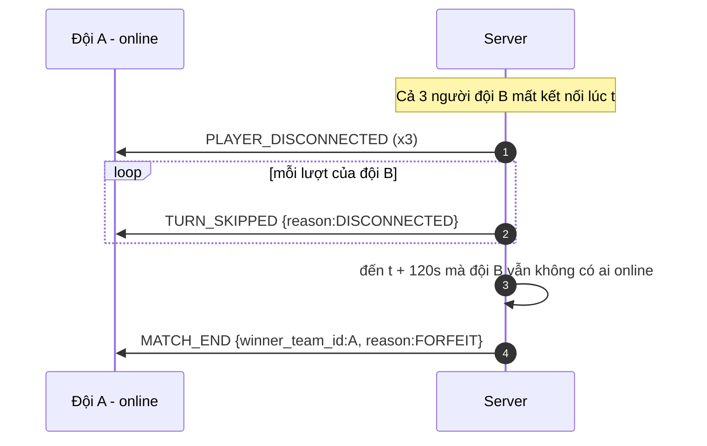

# Cả đội offline quá lâu (bỏ cuộc)

Mô tả luồng: [DESIGN.md](../../DESIGN.md)

```mermaid
sequenceDiagram
    autonumber
    participant A as Đội A - online
    participant S as Server

    Note over S: Cả 3 người đội B mất kết nối lúc t
    S->>A: PLAYER_DISCONNECTED (x3)
    loop mỗi lượt của đội B
        S->>A: TURN_SKIPPED {reason:DISCONNECTED}
    end
    S->>S: đến t + 120s mà đội B vẫn không có ai online
    S->>A: MATCH_END {winner_team_id:A, reason:FORFEIT}
```
