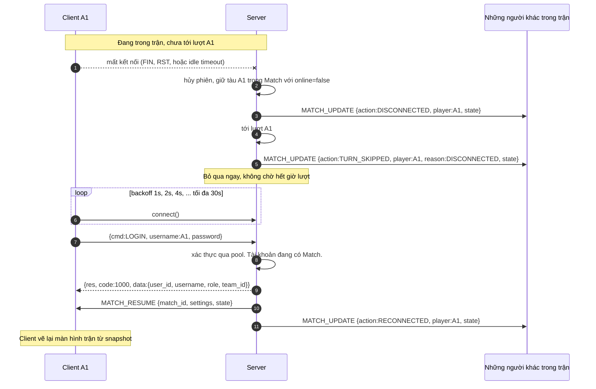

# Mất kết nối giữa trận rồi vào lại

Mô tả luồng: [DESIGN.md](../../DESIGN.md)

```mermaid
sequenceDiagram
    autonumber
    participant C as Client A1
    participant S as Server
    participant O as Những người khác trong trận

    Note over C,S: Đang trong trận, chưa tới lượt A1
    C--xS: mất kết nối (FIN, RST, hoặc idle timeout)
    S->>S: hủy phiên, giữ tàu A1 trong Match với online=false
    S->>O: MATCH_UPDATE {action:DISCONNECTED, player:A1, state}

    S->>S: tới lượt A1
    S->>O: MATCH_UPDATE {action:TURN_SKIPPED, player:A1, reason:DISCONNECTED, state}
    Note over S: Bỏ qua ngay, không chờ hết giờ lượt

    loop backoff 1s, 2s, 4s, ... tối đa 30s
        C->>S: connect()
    end
    C->>S: {cmd:LOGIN, username:A1, password}
    S->>S: xác thực qua pool. Tài khoản đang có Match.
    S-->>C: {res, code:1000, data:{user_id, username, role, team_id}}
    S->>C: MATCH_RESUME {match_id, settings, state}
    S->>O: MATCH_UPDATE {action:RECONNECTED, player:A1, state}
    Note over C: Client vẽ lại màn hình trận từ snapshot
```
