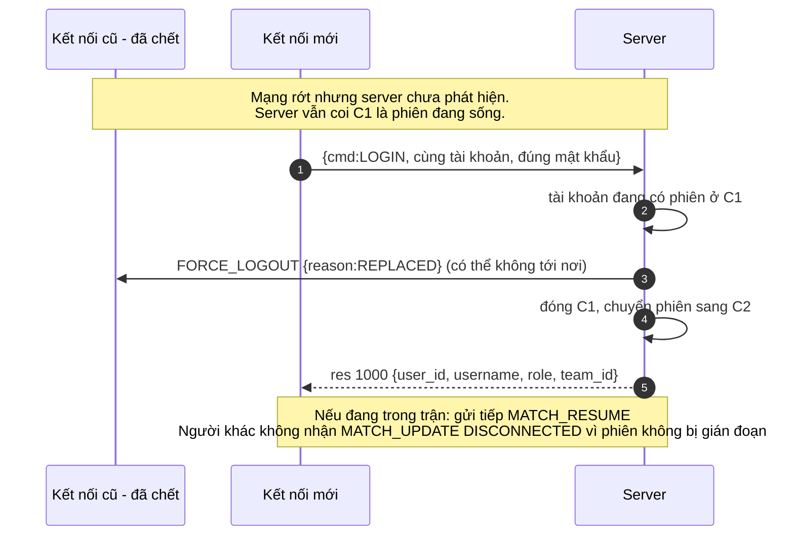

# Phiên cũ chưa kịp đóng (thay thế phiên)

Mô tả luồng: [DESIGN.md](../../DESIGN.md)

```mermaid
sequenceDiagram
    autonumber
    participant C1 as Kết nối cũ - đã chết
    participant C2 as Kết nối mới
    participant S as Server

    Note over C1,S: Mạng rớt nhưng server chưa phát hiện.<br/>Server vẫn coi C1 là phiên đang sống.
    C2->>S: {cmd:LOGIN, cùng tài khoản, đúng mật khẩu}
    S->>S: tài khoản đang có phiên ở C1
    S->>C1: FORCE_LOGOUT {reason:REPLACED} (có thể không tới nơi)
    S->>S: đóng C1, chuyển phiên sang C2
    S-->>C2: res 1000 {user_id, username, role, team_id}
    Note over C2,S: Nếu đang trong trận: gửi tiếp MATCH_RESUME<br/>Người khác không nhận MATCH_UPDATE DISCONNECTED vì phiên không bị gián đoạn
```
