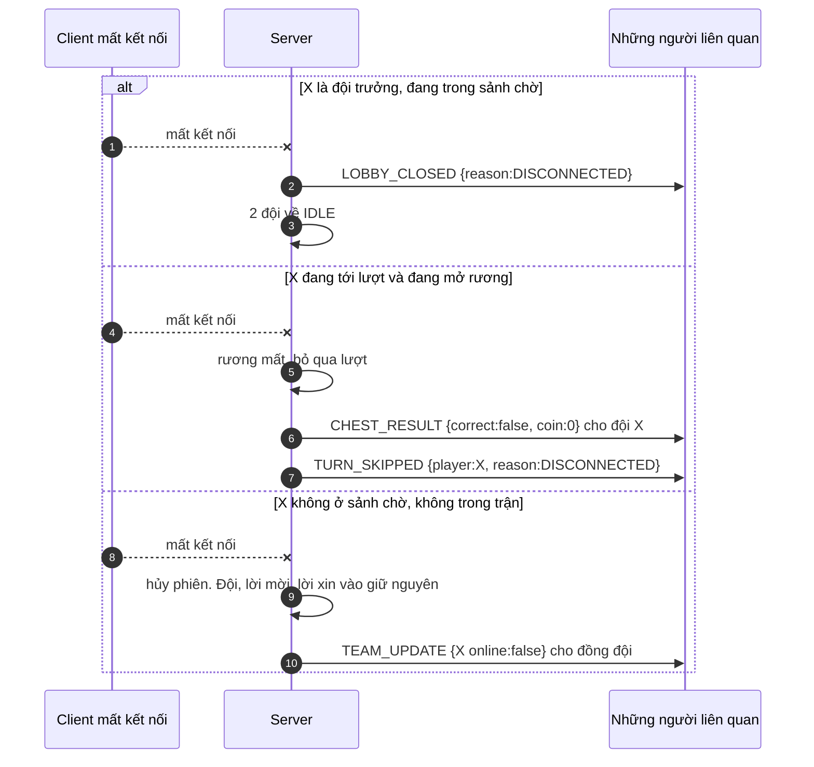

# Mất kết nối ở sảnh chờ, khi mở rương, khi rảnh

Mô tả luồng: [DESIGN.md](../../DESIGN.md)

```mermaid
sequenceDiagram
    autonumber
    participant X as Client mất kết nối
    participant S as Server
    participant O as Những người liên quan

    alt X là đội trưởng, đang trong sảnh chờ
        X--xS: mất kết nối
        S->>O: LOBBY_CLOSED {reason:DISCONNECTED}
        S->>S: 2 đội về IDLE
    else X đang tới lượt và đang mở rương
        X--xS: mất kết nối
        S->>S: rương mất, bỏ qua lượt
        S->>O: CHEST_RESULT {correct:false, coin:0} cho đội X
        S->>O: TURN_SKIPPED {player:X, reason:DISCONNECTED}
    else X không ở sảnh chờ, không trong trận
        X--xS: mất kết nối
        S->>S: hủy phiên. Đội, lời mời, lời xin vào giữ nguyên
        S->>O: TEAM_UPDATE {X online:false} cho đồng đội
    end
```
