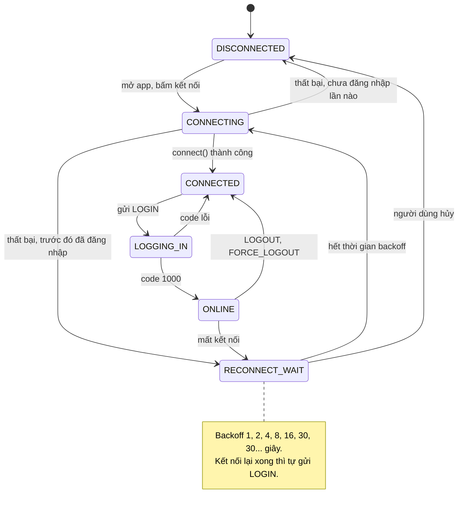

# Client: kết nối

Mô tả luồng: [DESIGN.md](../../DESIGN.md)

```mermaid
stateDiagram-v2
    [*] --> DISCONNECTED
    DISCONNECTED --> CONNECTING: mở app, bấm kết nối
    CONNECTING --> CONNECTED: connect() thành công
    CONNECTING --> RECONNECT_WAIT: thất bại, trước đó đã đăng nhập
    CONNECTING --> DISCONNECTED: thất bại, chưa đăng nhập lần nào
    CONNECTED --> LOGGING_IN: gửi LOGIN
    LOGGING_IN --> ONLINE: code 1000
    LOGGING_IN --> CONNECTED: code lỗi
    ONLINE --> CONNECTED: LOGOUT, FORCE_LOGOUT
    ONLINE --> RECONNECT_WAIT: mất kết nối
    RECONNECT_WAIT --> CONNECTING: hết thời gian backoff
    RECONNECT_WAIT --> DISCONNECTED: người dùng hủy

    note right of RECONNECT_WAIT
        Backoff 1, 2, 4, 8, 16, 30, 30... giây.
        Kết nối lại xong thì tự gửi LOGIN.
    end note
```
