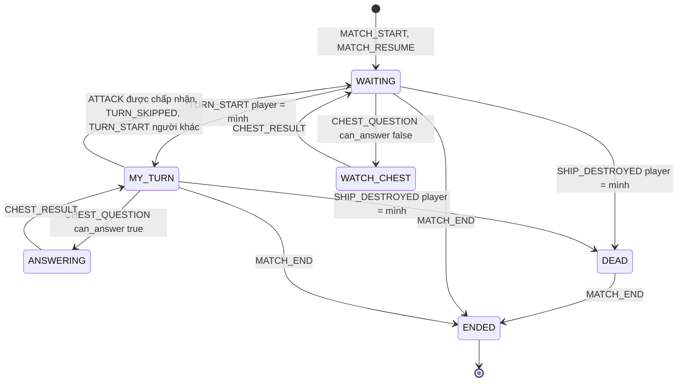

# Client: trong trận

Mô tả luồng: [DESIGN.md](../../DESIGN.md)

```mermaid
stateDiagram-v2
    [*] --> WAITING: MATCH_START, MATCH_RESUME
    WAITING --> MY_TURN: TURN_START player = mình
    WAITING --> WATCH_CHEST: CHEST_QUESTION can_answer false
    WATCH_CHEST --> WAITING: CHEST_RESULT
    MY_TURN --> ANSWERING: CHEST_QUESTION can_answer true
    ANSWERING --> MY_TURN: CHEST_RESULT
    MY_TURN --> WAITING: ATTACK được chấp nhận, TURN_SKIPPED, TURN_START người khác
    WAITING --> DEAD: SHIP_DESTROYED player = mình
    MY_TURN --> DEAD: SHIP_DESTROYED player = mình
    DEAD --> ENDED: MATCH_END
    WAITING --> ENDED: MATCH_END
    MY_TURN --> ENDED: MATCH_END
    ENDED --> [*]
```
