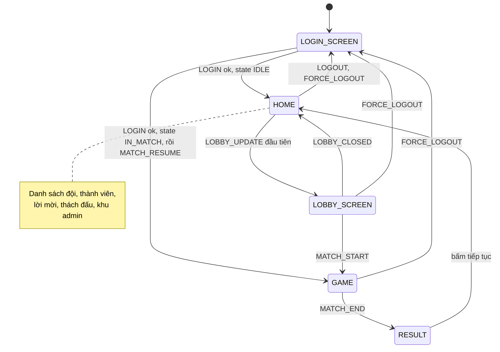

# Client: màn hình

Mô tả luồng: [DESIGN.md](../../DESIGN.md)

```mermaid
stateDiagram-v2
    [*] --> LOGIN_SCREEN
    LOGIN_SCREEN --> HOME: LOGIN ok, state IDLE
    LOGIN_SCREEN --> GAME: LOGIN ok, state IN_MATCH, rồi MATCH_RESUME
    HOME --> LOBBY_SCREEN: LOBBY_UPDATE đầu tiên
    LOBBY_SCREEN --> HOME: LOBBY_CLOSED
    LOBBY_SCREEN --> GAME: MATCH_START
    GAME --> RESULT: MATCH_END
    RESULT --> HOME: bấm tiếp tục
    HOME --> LOGIN_SCREEN: LOGOUT, FORCE_LOGOUT
    LOBBY_SCREEN --> LOGIN_SCREEN: FORCE_LOGOUT
    GAME --> LOGIN_SCREEN: FORCE_LOGOUT

    note right of HOME
        Danh sách đội, thành viên,
        lời mời, thách đấu, khu admin
    end note
```
