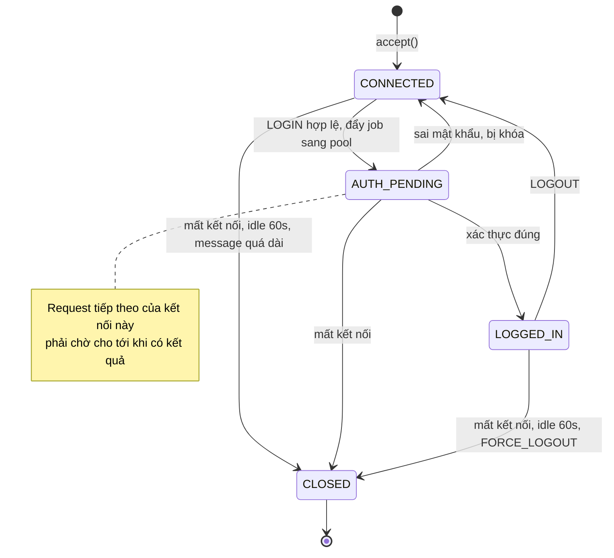

# Server: kết nối và phiên

Mô tả luồng: [DESIGN.md](../../DESIGN.md)

```mermaid
stateDiagram-v2
    [*] --> CONNECTED: accept()
    CONNECTED --> AUTH_PENDING: LOGIN hợp lệ, đẩy job sang pool
    AUTH_PENDING --> CONNECTED: sai mật khẩu, bị khóa
    AUTH_PENDING --> LOGGED_IN: xác thực đúng
    LOGGED_IN --> CONNECTED: LOGOUT
    CONNECTED --> CLOSED: mất kết nối, idle 60s, message quá dài
    AUTH_PENDING --> CLOSED: mất kết nối
    LOGGED_IN --> CLOSED: mất kết nối, idle 60s, FORCE_LOGOUT
    CLOSED --> [*]

    note right of AUTH_PENDING
        Request tiếp theo của kết nối này
        phải chờ cho tới khi có kết quả
    end note
```
