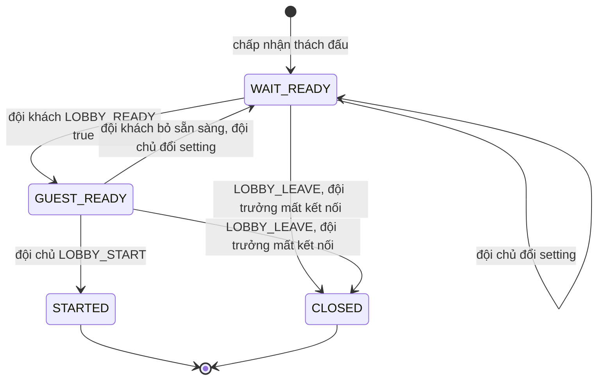

# Server: sảnh chờ

Mô tả luồng: [DESIGN.md](../../DESIGN.md)

```mermaid
stateDiagram-v2
    [*] --> WAIT_READY: chấp nhận thách đấu
    WAIT_READY --> GUEST_READY: đội khách LOBBY_READY true
    GUEST_READY --> WAIT_READY: đội khách bỏ sẵn sàng, đội chủ đổi setting
    WAIT_READY --> WAIT_READY: đội chủ đổi setting
    GUEST_READY --> STARTED: đội chủ LOBBY_START
    WAIT_READY --> CLOSED: LOBBY_LEAVE, đội trưởng mất kết nối
    GUEST_READY --> CLOSED: LOBBY_LEAVE, đội trưởng mất kết nối
    STARTED --> [*]
    CLOSED --> [*]
```
