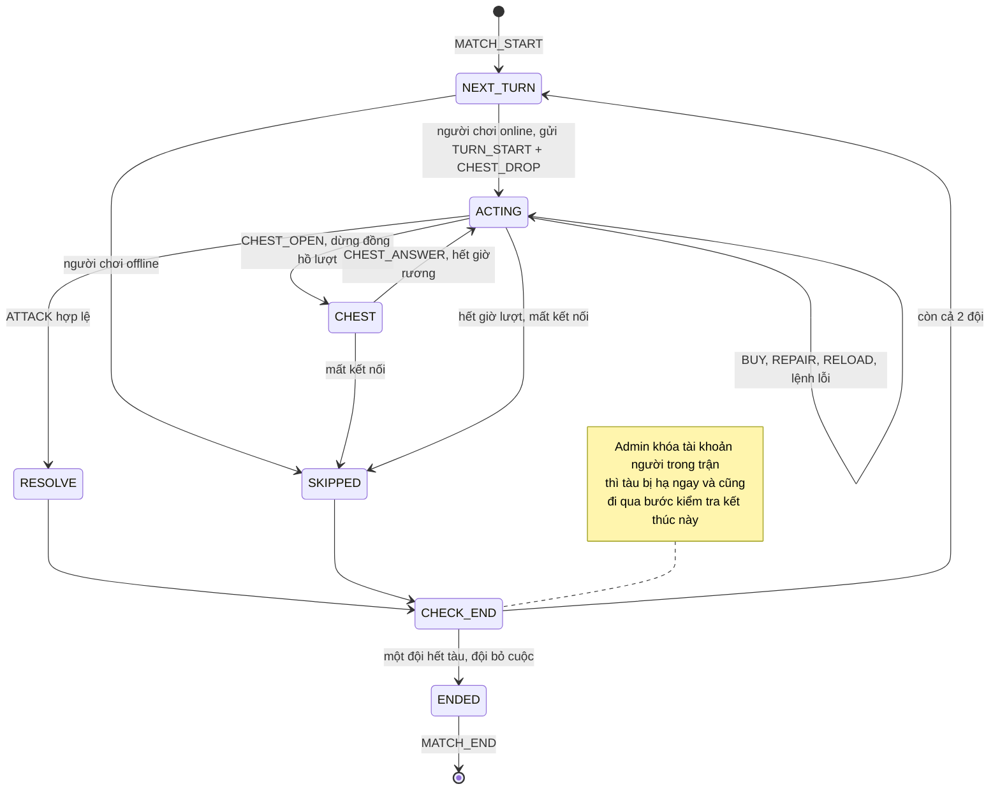

# Server: trận đấu và lượt

Mô tả luồng: [DESIGN.md](../../DESIGN.md)

```mermaid
stateDiagram-v2
    [*] --> NEXT_TURN: MATCH_START
    NEXT_TURN --> ACTING: người chơi online, gửi TURN_START + CHEST_DROP
    NEXT_TURN --> SKIPPED: người chơi offline
    ACTING --> ACTING: BUY, REPAIR, RELOAD, lệnh lỗi
    ACTING --> CHEST: CHEST_OPEN, dừng đồng hồ lượt
    CHEST --> ACTING: CHEST_ANSWER, hết giờ rương
    CHEST --> SKIPPED: mất kết nối
    ACTING --> RESOLVE: ATTACK hợp lệ
    ACTING --> SKIPPED: hết giờ lượt, mất kết nối
    RESOLVE --> CHECK_END
    SKIPPED --> CHECK_END
    CHECK_END --> ENDED: một đội hết tàu, đội bỏ cuộc
    CHECK_END --> NEXT_TURN: còn cả 2 đội
    ENDED --> [*]: MATCH_END

    note left of CHECK_END
        Admin khóa tài khoản người trong trận
        thì tàu bị hạ ngay và cũng
        đi qua bước kiểm tra kết thúc này
    end note
```
