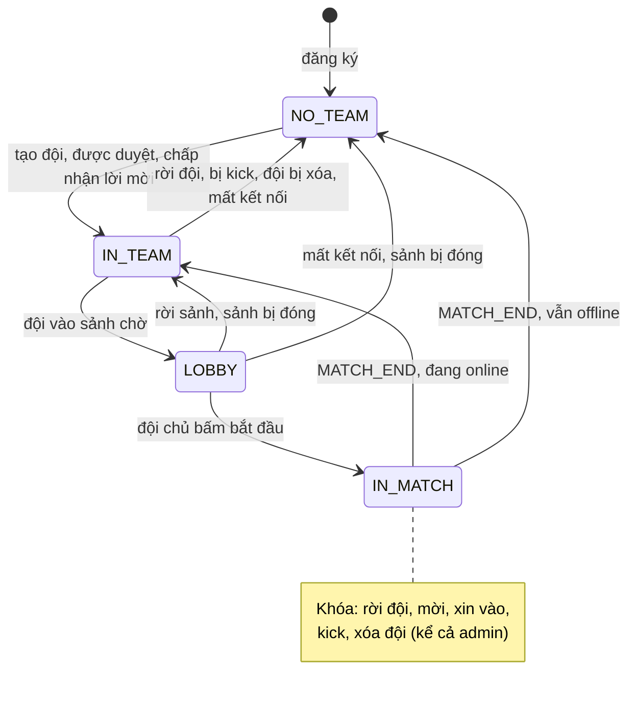

# Server: trạng thái người chơi

Mô tả luồng: [DESIGN.md](../../DESIGN.md)

```mermaid
stateDiagram-v2
    [*] --> NO_TEAM: đăng ký
    NO_TEAM --> IN_TEAM: tạo đội, được duyệt, chấp nhận lời mời
    IN_TEAM --> NO_TEAM: rời đội, bị kick, đội bị xóa, mất kết nối
    IN_TEAM --> LOBBY: đội vào sảnh chờ
    LOBBY --> IN_TEAM: rời sảnh, sảnh bị đóng
    LOBBY --> NO_TEAM: mất kết nối, sảnh bị đóng
    LOBBY --> IN_MATCH: đội chủ bấm bắt đầu
    IN_MATCH --> IN_TEAM: MATCH_END, đang online
    IN_MATCH --> NO_TEAM: MATCH_END, vẫn offline

    note right of IN_MATCH
        Khóa: rời đội, mời, xin vào,
        kick, xóa đội (kể cả admin)
    end note
```
